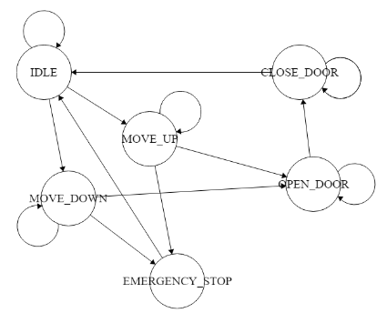

# Elevator Controller in VHDL 

## Background Information
An elevator or lift is a vertical transportation mechanism designed to carry individuals or objects from one level or floor to another within a multi-story building structure. This system is an integral component in various modern buildings such as offices, malls, hotels, healthcare centers, multi-story residences, and more. The elevator facility ensures quick and efficient accessibility between different levels without requiring users to utilize stairs and expend energy.

The Elevator Controller serves as the core component of the entire elevator system's functionality. Its tasks encompass managing all operations that occur within the elevator, ranging from floor navigation, door control, to responding in emergency situations. This controller can be programmed to oversee various aspects such as elevator traffic control, safety features, energy efficiency, and optimization for mobility.

## Description
The Elevator Controller will regulate the lift's movement, enabling navigation between different floors in response to user requests. Key features to be integrated include Open and Close buttons that interrupt the handler, as well as a weight detector to ensure the elevator does not exceed its maximum capacity. Additionally, the system will be equipped with an emergency alarm to enhance user safety in emergency situations.

## Feature
- Idle 
- Weight handler  (If exceeding the maximum limit, the elevator doors cannot be closed)
- Emergency situation (In case of an emergency, the elevator will shut down and automatically open its doors)

## Finite State Machine

